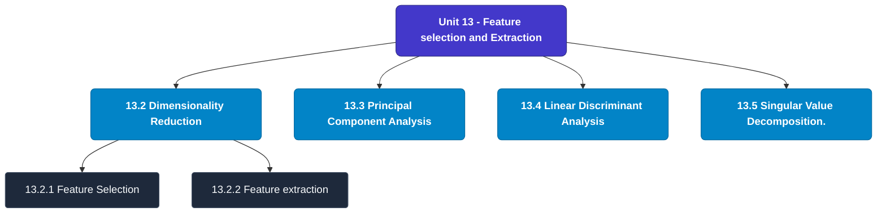

# MCS-224: Artificial Intelligence & Machine Learning
## Unit 13: Feature selection and Extraction

> 📚 **Programme:** M.Sc. (Data Science and Analytics) | **Semester:** Semester 2  
> ⏱️ **Estimated Study Time:** ~47 mins | 📄 **Textbook Pages:** 24 Pages  
> 📥 **Original PDF:** [Download & View Textbook](../../../pdfs/Semester_2/MCS-224_Artificial_Intelligence_and_Machine_Learning/Unit-13_Feature_selection_and_Extraction.pdf)

---

### 🎯 Executive Concept & Data Science Relevance
In modern data systems, **Feature selection and Extraction** forms a vital conceptual pillar. Artificial Intelligence models autonomous decision-making, while Machine Learning extracts predictive statistical patterns from data. From A* pathfinding in logistics to Deep Neural Networks powering Computer Vision and LLMs, AI/ML drives modern automated systems.

> [!NOTE]
> **Why this matters for your career:** Mastering feature selection and extraction equips you with the foundational principles required to reason mathematically about high-dimensional datasets, evaluate algorithm performance, and avoid statistical pitfalls in production machine learning pipelines.

### 🗺️ Visual Knowledge Architecture
The following concept map illustrates the structural hierarchy and learning trajectory of this module:

### 📖 Core Definitions & Terminology Cards
| Term | Formal Mathematical / Technical Definition | Intuitive Analogy / Concrete Example |
| :--- | :--- | :--- |
| **A* Search Algorithm** | Best-first graph search evaluating states by $f(n) = g(n) + h(n)$, where $g(n)$ is true cost from start to $n$, and $h(n)$ is heuristic estimate to goal. Guarantees optimal path if $h(n)$ is admissible ($h(n) \le h^*(n)$). | *Finding the fastest route on GPS navigation without exploring irrelevant directions.* |
| **Entropy and Information Gain** | Entropy $H(S) = -\sum p_i \log_2 p_i$ measures impurity. Information Gain $IG(S, A) = H(S) - \sum \frac{\|S_v\|}{\|S\|} H(S_v)$ measures reduction in entropy achieved by splitting on feature $A$. | *The mathematical criterion used by Decision Trees to select the most informative split attribute.* |
| **Support Vector Machine (SVM) Margin** | Linear classifier finding the hyperplane maximizing the geometric margin $\frac{2}{\\|\mathbf{w}\\|}$ between classes, subject to $y_i(\mathbf{w}^T \mathbf{x}_i + b) \ge 1$. Non-linear data is separated using Kernel functions $K(\mathbf{x}, \mathbf{z}) = \phi(\mathbf{x})^T \phi(\mathbf{z})$. | *Finding the widest possible road separating positive and negative data clusters.* |
| **Backpropagation Algorithm** | Iterative parameter optimization in neural networks utilizing the multivariate chain rule to propagate error gradients backwards from the loss function to update synaptic weights: $w_{ij} \leftarrow w_{ij} - \alpha \frac{\partial \mathcal{L}}{\partial w_{ij}}$. | *Automated blame assignment: adjusting each internal weight proportionally to how much it contributed to prediction error.* |

### ⚡ Governing Mathematical Laws & Formula Cheatsheet
#### 🔹 A* Heuristic Evaluation Function
$$f(n) = g(n) + h(n) \quad \text{Admissibility: } 0 \le h(n) \le h^*(n)$$
- **Explanation:** If $h(n)$ never overestimates true remaining cost, A* tree search is guaranteed to return the optimal shortest path.

#### 🔹 Shannon Entropy Formula
$$H(S) = -\sum_{i=1}^c p_i \log_2 p_i \quad \text{Gini Impurity: } 1 - \sum_{i=1}^c p_i^2$$
- **Explanation:** Measures disorder in classification distributions; equals 0 when all samples belong to one class.

#### 🔹 Gradient Descent Weight Update Rule
$$\mathbf{w}^{(t+1)} = \mathbf{w}^{(t)} - \alpha \nabla_{\mathbf{w}} \mathcal{L}(\mathbf{w})$$
- **Explanation:** Stepping parameter vector opposite to the gradient vector scaled by learning rate $\alpha$.

#### 🔹 Neural Network Output Softmax Function
$$\text{Softmax}(z_i) = \frac{e^{z_i}}{\sum_{j=1}^K e^{z_j}}$$
- **Explanation:** Normalizes $K$ arbitrary logit outputs into a valid multi-class probability distribution summing to 1.

### 📌 Detailed Section-by-Section Study Breakdown
#### `13.2` Dimensionality Reduction
- **Core Concept:** The Data mining and Machine Learning methodologies both have processing challenges when working with big amounts of data (many attributes).
- **Core Concept:** In point of fact, the dimensions of the feature space utilised by the approach, often referred to as the model attributes, play the most important function.
- **Core Concept:** Processing algorithms grow more difficult and time-consuming to implement as the dimensionality of the processing space increases.
- **Data Science Application:** Provides foundational structures used directly in statistical modeling, query execution, and machine learning pipelines.

> [!TIP]
> **Exam & Interview Tip:** Be prepared to state the formal definition of dimensionality reduction and derive its primary equations step-by-step.

#### `13.2.1` Feature Selection
- **Core Concept:** It is the process of selecting some attributes from a given collection of prospective features, and then discarding the rest of the attributes that were considered.
- **Core Concept:** The use of feature selection can be done for one of two reasons: either to get a limited number of characteristics in order to prevent overfitting or to avoid having features that are redundant or irrelevant.
- **Core Concept:** For data scientists, the ability to pick features is a vital asset.
- **Data Science Application:** Provides foundational structures used directly in statistical modeling, query execution, and machine learning pipelines.

> [!TIP]
> **Exam & Interview Tip:** Be prepared to state the formal definition of feature selection and derive its primary equations step-by-step.

#### `13.2.2` Feature extraction
- **Core Concept:** The process of reducing the amount of resources needed to describe a large amount of data is called "feature extraction." One of the main problems with doing complicated data analysis is that there are a lot of variables to keep track of.
- **Core Concept:** A large number of variables requires a lot of memory and processing power, and it can also cause a classification algorithm to overfit to training examples and fail to generalise to new samples.
- **Core Concept:** Feature extraction is a broad term for different ways to combine variables to get around these problems while still giving a true picture of the data.
- **Data Science Application:** Provides foundational structures used directly in statistical modeling, query execution, and machine learning pipelines.

> [!TIP]
> **Exam & Interview Tip:** Be prepared to state the formal definition of feature extraction and derive its primary equations step-by-step.

#### `13.3` Principal Component Analysis
- **Core Concept:** Karl Pearson was the first person to come up with this plan.
- **Core Concept:** It is based on the idea that when data from a higher-dimensional space is put into a lower-dimensional space, the lower-dimensional space should have the most variation.
- **Core Concept:** In simple terms, principal component analysis (PCA) is a way to get important variables (in the form of components) from a large set of variables in a data set.
- **Data Science Application:** Provides foundational structures used directly in statistical modeling, query execution, and machine learning pipelines.

> [!TIP]
> **Exam & Interview Tip:** Be prepared to state the formal definition of principal component analysis and derive its primary equations step-by-step.

#### `13.4` Linear Discriminant Analysis
- **Core Concept:** In most cases, the application of logistic regression has been restricted to problems involving two classes of subjects.
- **Core Concept:** On the other hand, the Linear Discriminant Analysis is the linear classification method that is recommended to use when there are more than two classes.
- **Core Concept:** The algorithm for linear classification known as logistic regression is known for being both straightforward and robust.
- **Data Science Application:** Provides foundational structures used directly in statistical modeling, query execution, and machine learning pipelines.

> [!TIP]
> **Exam & Interview Tip:** Be prepared to state the formal definition of linear discriminant analysis and derive its primary equations step-by-step.

#### `13.5` Singular Value Decomposition.
- **Core Concept:** The Singular Value Decomposition (SVD) method is a well-known technique for decomposing a matrix into a large number of component matrices.
- **Core Concept:** This method is valuable since it reveals many of the interesting and helpful characteristics of the initial matrix.
- **Core Concept:** We can use SVD to discover the optimal lower-rank approximation to the matrix, determine the rank of the matrix, or test a linear system's sensitivity to numerical error.
- **Data Science Application:** Provides foundational structures used directly in statistical modeling, query execution, and machine learning pipelines.

> [!TIP]
> **Exam & Interview Tip:** Be prepared to state the formal definition of singular value decomposition. and derive its primary equations step-by-step.

### 💡 Interactive Self-Assessment Checkpoints
Test your comprehension before proceeding. Tap each question to reveal the comprehensive explanation:

<b>Checkpoint 1:</b> What condition must a heuristic $h(n)$ satisfy for A* search to be optimal? <i>(Tap to reveal answer)</i>

> **Answer & Analysis:**  
> The heuristic must be **Admissible**, meaning it never overestimates the actual minimal cost to reach the goal state ($h(n) \le h^*(n)$).

<b>Checkpoint 2:</b> What is the formula for Information Gain used in Decision Trees? <i>(Tap to reveal answer)</i>

> **Answer & Analysis:**  
> $$IG(S, A) = H(S) - \sum_{v \in \text{Values}(A)} \frac{|S_v|}{|S|} H(S_v)$$

<b>Checkpoint 3:</b> Why is the Softmax function used in multi-class classification neural networks? <i>(Tap to reveal answer)</i>

> **Answer & Analysis:**  
> It converts unconstrained real numbers (logits) into a valid probability distribution where each value is in $[0, 1]$ and all values sum strictly to $1$.

<b>Checkpoint 4:</b> Define the term feature selection. Qn <i>(Tap to reveal answer)</i>

> **Answer & Analysis:**  
> This question tests your conceptual mastery of Feature selection and Extraction. Review the governing formulas and section breakdowns above to formulate a complete, rigorous proof or derivation.

<b>Checkpoint 5:</b> What is the purpose of feature extraction in machine learning? Qn <i>(Tap to reveal answer)</i>

> **Answer & Analysis:**  
> This question tests your conceptual mastery of Feature selection and Extraction. Review the governing formulas and section breakdowns above to formulate a complete, rigorous proof or derivation.

<b>Checkpoint 6:</b> Expand the following terms : PCA,LDA,GDA Qn <i>(Tap to reveal answer)</i>

> **Answer & Analysis:**  
> This question tests your conceptual mastery of Feature selection and Extraction. Review the governing formulas and section breakdowns above to formulate a complete, rigorous proof or derivation.

### 🎯 Executive Module Wrap-Up
- **Central Idea:** Feature selection and Extraction provides essential mathematical and algorithmic tools directly utilized in Data Science.
- **Mathematical Rigor:** Formulas and laws must be memorized with attention to boundary conditions and assumptions.
- **Full Textbook Coverage:** For exhaustive multi-page derivations, proofs, and supplementary exercises, consult the [Authentic IGNOU Textbook](../../../pdfs/Semester_2/MCS-224_Artificial_Intelligence_and_Machine_Learning/Unit-13_Feature_selection_and_Extraction.pdf).

---
### 🧭 Navigation & Syllabus Index
[⬅ Previous: Unit 12](unit_12_Neural_Networks_and_Deep_Learning.md) | [📑 Course Index](README.md) | [Next: Unit 14 ➡](unit_14_Association_Rules.md)
