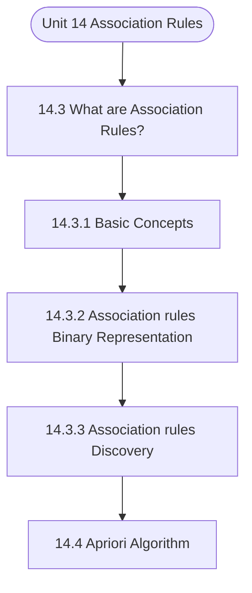

# MCS-224: Artificial Intelligence & Machine Learning
## Unit 14: Association Rules

> 📚 **Programme:** M.Sc. (Data Science and Analytics) | **Semester:** Semester 2  
> ⏱️ **Estimated Study Time:** ~40 mins | 📄 **Textbook Pages:** 28 Pages  
> 📥 **Original PDF:** [Download & View Authentic Textbook](../../../pdfs/Semester_2/MCS-224_Artificial_Intelligence_and_Machine_Learning/Unit-14_Association_Rules.pdf)

---

### 🎯 Executive Concept & Data Science Relevance
In modern data systems, **Association Rules** forms a vital conceptual pillar. Artificial Intelligence models autonomous decision-making, while Machine Learning extracts predictive statistical patterns from data. From A* pathfinding in logistics to Deep Neural Networks powering Computer Vision and LLMs, AI/ML drives modern automated systems.

> [!NOTE]
> **Why this matters for your career:** Mastering association rules equips you with the foundational principles required to reason mathematically about high-dimensional datasets, evaluate algorithm performance, and avoid statistical pitfalls in production machine learning pipelines.

### 🗺️ Visual Knowledge Architecture
The following concept map illustrates the structural hierarchy and learning trajectory of this module:



### 📖 Core Definitions & Terminology Cards

> 📌 **A* Search Algorithm**  
> - **Formal Definition:** Best-first graph search evaluating states by $f(n) = g(n) + h(n)$, where $g(n)$ is true cost from start to $n$, and $h(n)$ is heuristic estimate to goal. Guarantees optimal path if $h(n)$ is admissible ( $h(n) \le h^*(n)$ ).  
> - 💡 **Practical Intuition & Analogy:** *Finding the fastest route on GPS navigation without exploring irrelevant directions.*

> 📌 **Entropy and Information Gain**  
> - **Formal Definition:** Entropy $H(S) = -\sum p_i \log_2 p_i$ measures impurity. Information Gain $IG(S, A) = H(S) - \sum \frac{\vert S_v \vert}{\vert S \vert} H(S_v)$ measures reduction in entropy achieved by splitting on feature $A$.  
> - 💡 **Practical Intuition & Analogy:** *The mathematical criterion used by Decision Trees to select the most informative split attribute.*

> 📌 **Support Vector Machine (SVM) Margin**  
> - **Formal Definition:** Linear classifier finding the hyperplane maximizing the geometric margin $\frac{2}{\Vert\mathbf{w}\Vert}$ between classes, subject to $y_i(\mathbf{w}^T \mathbf{x}_i + b) \ge 1$. Non-linear data is separated using Kernel functions $K(\mathbf{x}, \mathbf{z}) = \phi(\mathbf{x})^T \phi(\mathbf{z})$.  
> - 💡 **Practical Intuition & Analogy:** *Finding the widest possible road separating positive and negative data clusters.*

> 📌 **Backpropagation Algorithm**  
> - **Formal Definition:** Iterative parameter optimization in neural networks utilizing the multivariate chain rule to propagate error gradients backwards from the loss function to update synaptic weights: $w_{ij} \leftarrow w_{ij} - \alpha \frac{\partial \mathcal{L}}{\partial w_{ij}}$.  
> - 💡 **Practical Intuition & Analogy:** *Automated blame assignment: adjusting each internal weight proportionally to how much it contributed to prediction error.*

### ⚡ Governing Mathematical Laws & Formula Cheatsheet
#### 🔹 A* Heuristic Evaluation Function
$$
f(n) = g(n) + h(n) \quad \text{Admissibility: } 0 \le h(n) \le h^*(n)
$$
- **Explanation:** If $h(n)$ never overestimates true remaining cost, A* tree search is guaranteed to return the optimal shortest path.

#### 🔹 Shannon Entropy Formula
$$
H(S) = -\sum_{i=1}^c p_i \log_2 p_i \quad \text{Gini Impurity: } 1 - \sum_{i=1}^c p_i^2
$$
- **Explanation:** Measures disorder in classification distributions; equals 0 when all samples belong to one class.

#### 🔹 Gradient Descent Weight Update Rule
$$
\mathbf{w}^{(t+1)} = \mathbf{w}^{(t)} - \alpha \nabla_{\mathbf{w}} \mathcal{L}(\mathbf{w})
$$
- **Explanation:** Stepping parameter vector opposite to the gradient vector scaled by learning rate $\alpha$.

#### 🔹 Neural Network Output Softmax Function
$$
\text{Softmax}(z_i) = \frac{e^{z_i}}{\sum_{j=1}^K e^{z_j}}
$$
- **Explanation:** Normalizes $K$ arbitrary logit outputs into a valid multi-class probability distribution summing to 1.

### ⚖️ Axiomatic Properties & Governing Laws
The mathematical formulations of this module are anchored by foundational algebraic and structural laws:

- **Heuristic Consistency Condition:** $h(n) \le c(n, a, n') + h(n') \implies \text{Monotonic (Guarantees A* optimality on graphs)}$
- **SVM Dual Formulation:** $\max_\alpha \sum \alpha_i - \frac{1}{2}\sum \alpha_i \alpha_j y_i y_j K(\mathbf{x}_i, \mathbf{x}_j)$
- **Universal Approximation Theorem:** A feedforward network with one non-linear hidden layer can approximate any continuous function on compact subsets of $\mathbb{R}^n$.

### 📌 Comprehensive Section-by-Section Study Breakdown
#### `14.3` What are Association Rules?
##### 📘 Theoretical Principles & In-Depth Exposition
There are few terms that one should understand before understanding the algorithm. k-Itemset: It is a set of kitems. For example, 2-itemset can be {pencil, eraser} or {bread, butter} etc., 3-itemset can be {bread, butter, milk}. Support: Frequency of appearance of an item appears in all the considered transactions is called as the support of an item.

Mathematically, support of an item x is defined as: c. Confidence: Confidence is defined as the likelihood of obtaining item y along with an item x. Mathematically, it is defined as the ratio of frequency of transactions containing items x and y to the frequency of transactions that contained item x.

Confidence can also be defined as probability of occurrence of y, given probability of occurrence of x. confidence(x=>y) = P(y/x) where x is antecedent, and y is a consequent. In terms of support, confidence can be described as: d. Frequent Itemset: An item whose support is at least the minimum support threshold is known as a frequent itemset.

##### ⚙️ Mathematical & Algorithmic Mechanics
- **Formal Mechanics:** Establishes symbolic transformations and state invariants governing what are association rules?.
- **Boundary Invariants:** Ensures robust error-handling, non-empty set guarantees, and strict asymptotic bounds.

##### 📊 Practical Data Science & Production Relevance
- **Industry Application:** Directly implemented in production workflows such as SQL query filters, pandas vectorized operations, and feature transformation pipelines.
- **Production Pitfall:** Failing to verify membership bounds or missing edge cases in what are association rules? can cause silent data corruption or performance bottlenecks.

> [!TIP]
> **Key Exam & Technical Interview Takeaway:** Be prepared to define what are association rules? formally, cite its core mathematical invariants, and solve step-by-step numerical/proof questions.

#### `14.3.1` Basic Concepts
##### 📘 Theoretical Principles & In-Depth Exposition
There are few terms that one should understand before understanding the algorithm. k-Itemset: It is a set of kitems. For example, 2-itemset can be {pencil, eraser} or {bread, butter} etc., 3-itemset can be {bread, butter, milk}. Support: Frequency of appearance of an item appears in all the considered transactions is called as the support of an item.

Mathematically, support of an item x is defined as: c. Confidence: Confidence is defined as the likelihood of obtaining item y along with an item x. Mathematically, it is defined as the ratio of frequency of transactions containing items x and y to the frequency of transactions that contained item x.

Confidence can also be defined as probability of occurrence of y, given probability of occurrence of x. confidence(x=>y) = P(y/x) where x is antecedent, and y is a consequent. In terms of support, confidence can be described as: d. Frequent Itemset: An item whose support is at least the minimum support threshold is known as a frequent itemset.

##### ⚙️ Mathematical & Algorithmic Mechanics
- **Formal Mechanics:** Establishes symbolic transformations and state invariants governing basic concepts.
- **Boundary Invariants:** Ensures robust error-handling, non-empty set guarantees, and strict asymptotic bounds.

##### 📊 Practical Data Science & Production Relevance
- **Industry Application:** Directly implemented in production workflows such as SQL query filters, pandas vectorized operations, and feature transformation pipelines.
- **Production Pitfall:** Failing to verify membership bounds or missing edge cases in basic concepts can cause silent data corruption or performance bottlenecks.

> [!TIP]
> **Key Exam & Technical Interview Takeaway:** Be prepared to define basic concepts formally, cite its core mathematical invariants, and solve step-by-step numerical/proof questions.

#### `14.3.2` Association rules: Binary Representation
##### 📘 Theoretical Principles & In-Depth Exposition
Let I = {I1, I2, I3……..In} be a set of n items and T = {T1, T2, T3……..Tt} be a set of t transactions, where each transaction Ti contains a not null set of items purchased by a customer such that Ti⊆ I . Let each item Ii in the store be represented by a binary variable, B. The variable takes up the value 0 or 1, representing the absence or presence of item at the store.

B(i) = 1,if an item Ii is available at the store 0, otherwise Machine Learning - II For example, consider a set of four transactions T1, T2, T3 and T4 with the following items: T1 = {milk, cookies, bread}, T2 = {milk, bread, egg, butter}, T3 = {milk, cookies, bread, butter}, and T4 = {cookies, bread, butter}.

The binary representations for the transaction set are shown in Table 1. Table1: Binary representation of the transactions Transaction id Milk Cookies Bread Butter Egg T1 T2 T3 T4 The binary variable can also be used to analyze the purchasing patterns of the customers. One can analyze a basket in terms of binary values of the items that customer has purchased.

##### ⚙️ Mathematical & Algorithmic Mechanics
- **Formal Mechanics:** Establishes symbolic transformations and state invariants governing association rules: binary representation.
- **Boundary Invariants:** Ensures robust error-handling, non-empty set guarantees, and strict asymptotic bounds.

##### 📊 Practical Data Science & Production Relevance
- **Industry Application:** Directly implemented in production workflows such as SQL query filters, pandas vectorized operations, and feature transformation pipelines.
- **Production Pitfall:** Failing to verify membership bounds or missing edge cases in association rules: binary representation can cause silent data corruption or performance bottlenecks.

> [!TIP]
> **Key Exam & Technical Interview Takeaway:** Be prepared to define association rules: binary representation formally, cite its core mathematical invariants, and solve step-by-step numerical/proof questions.

#### `14.3.3` Association rules Discovery
##### 📘 Theoretical Principles & In-Depth Exposition
The problem of discovery of association rules can be stated as: Given a set of transactions T, find the rules whose support and confidence are greater than equal to the minimum support and confidence threshold. Traditional approach to generate association rules is to compute the support and confidence for every possible combination of items.

Butt his approach is computationally not possible as the number of combinations of items can be exponentially large. To avoid such large number of computations, basic approach should be to ignore the needless computations without computing their support and confidence scores. For example, we can observe from Table 1 that the combination {milk, egg} can be ignored as the combination if infrequent.

Hence, we prune the rule Milk => Egg without computing the support and confidence for the items. Therefore, the steps for obtaining association rules can be summarized as: 1. Find all frequent item sets: By definition, obtain the frequent itemset as set of items whose support score is at least the min_sup.

##### ⚙️ Mathematical & Algorithmic Mechanics
- **Formal Mechanics:** Establishes symbolic transformations and state invariants governing association rules discovery.
- **Boundary Invariants:** Ensures robust error-handling, non-empty set guarantees, and strict asymptotic bounds.

##### 📊 Practical Data Science & Production Relevance
- **Industry Application:** Directly implemented in production workflows such as SQL query filters, pandas vectorized operations, and feature transformation pipelines.
- **Production Pitfall:** Failing to verify membership bounds or missing edge cases in association rules discovery can cause silent data corruption or performance bottlenecks.

> [!TIP]
> **Key Exam & Technical Interview Takeaway:** Be prepared to define association rules discovery formally, cite its core mathematical invariants, and solve step-by-step numerical/proof questions.

#### `14.4` Apriori Algorithm
##### 📘 Theoretical Principles & In-Depth Exposition
R Aggarwal and R.Srikant proposed Apriori algorithm in the year 1994. The algorithm is used to obtain the frequent item sets for association rules. The algorithm is names so, as it needs the prior knowledge of the frequent item sets. This section discusses about the generation of frequent patterns as observed in the analysis of market basket problem.

Section 1.4.1 presents Apriori algorithm, used to obtain the frequent item sets. Section 1.4.2 talks about generating strong association rules from the frequent item sets generated. Finally, section 1.4.3 presents variations of Apriori algorithm.

##### ⚙️ Mathematical & Algorithmic Mechanics
- **Formal Mechanics:** Establishes symbolic transformations and state invariants governing apriori algorithm.
- **Boundary Invariants:** Ensures robust error-handling, non-empty set guarantees, and strict asymptotic bounds.

##### 📊 Practical Data Science & Production Relevance
- **Industry Application:** Directly implemented in production workflows such as SQL query filters, pandas vectorized operations, and feature transformation pipelines.
- **Production Pitfall:** Failing to verify membership bounds or missing edge cases in apriori algorithm can cause silent data corruption or performance bottlenecks.

> [!TIP]
> **Key Exam & Technical Interview Takeaway:** Be prepared to define apriori algorithm formally, cite its core mathematical invariants, and solve step-by-step numerical/proof questions.

#### `14.4.1` Frequent Itemsets Generation
##### 📘 Theoretical Principles & In-Depth Exposition
For a given set of n items, there are 2n-1 possible combination of items. Consider an itemset I = {A, B, C, D} with four items, there are 15 combinations of items such as {{A}, {B}, {C}, {D}, {A, B}, {A, C}, {A, D}, {B, C}, {B, D}, {C, D}, {A, B, C}, {A, B, D}, {A, C, D}, {B, C, D}, {A, B, C, D}}.

This can be represented by a lattice diagram as shown in Figure 3. Figure 3: Lattice representing 15 combinations of items Apriori algorithm searches the items level by level; to find the (k+1)item sets, it uses the kitem sets. To determine the frequent item sets, the algorithm first finds the candidate item sets from the lattice representation.

But as explained, for a given item sets of size n, maximum number of item sets in the lattice can be 2n -1, one needs to control the search space in exponentially growing item sets and increase the efficiency of the algorithm. For this, two important principles are given below. Definition 1: Apriori Principle: If an itemset is frequent, then all of its subsets must be frequent.

##### ⚙️ Mathematical & Algorithmic Mechanics
- **Formal Mechanics:** Establishes symbolic transformations and state invariants governing frequent itemsets generation.
- **Boundary Invariants:** Ensures robust error-handling, non-empty set guarantees, and strict asymptotic bounds.

##### 📊 Practical Data Science & Production Relevance
- **Industry Application:** Directly implemented in production workflows such as SQL query filters, pandas vectorized operations, and feature transformation pipelines.
- **Production Pitfall:** Failing to verify membership bounds or missing edge cases in frequent itemsets generation can cause silent data corruption or performance bottlenecks.

> [!TIP]
> **Key Exam & Technical Interview Takeaway:** Be prepared to define frequent itemsets generation formally, cite its core mathematical invariants, and solve step-by-step numerical/proof questions.

#### `14.4.2` Case Study
##### 📘 Theoretical Principles & In-Depth Exposition
set of items Consider the set of transactions represented in binary form in Table 1 as given below. Assume minimum support threshold to be 2. Transaction Id List of items T1 Milk, Cookies, Bread T2 Milk, Bread, Egg, Butter T3 Milk, Cookies, Bread, Butter T4 Cookies, Bread, Butter Step 1: Arrange the items in lexicographic order.

Call this candidate set C(1) Transaction Id List of items T1 Bread, Cookies, Milk T2 Bread, Butter, Egg, Milk T3 Bread, Butter, Cookies, Milk T4 Bread, Butter, Cookies Step 2: Obtain support score for each item in candidate itemset C(1) as: S. Item Support Bread Butter Cookies Egg Milk Association Rules Step 3: Prune the items whose support score is less than the minimum support threshold.

This results in 1-frequent itemset, F(1). Item Support Bread Butter Cookies Milk Step 4: Generate 2-candidate itemsets from F(1) obtained in previous step and obtain support score of each itemset i.e frequency of each itemset in the original transaction set. As support score of each itemset is at least 2, hence, none of the itemset is pruned.

##### ⚙️ Mathematical & Algorithmic Mechanics
- **Formal Mechanics:** Establishes symbolic transformations and state invariants governing case study.
- **Boundary Invariants:** Ensures robust error-handling, non-empty set guarantees, and strict asymptotic bounds.

##### 📊 Practical Data Science & Production Relevance
- **Industry Application:** Directly implemented in production workflows such as SQL query filters, pandas vectorized operations, and feature transformation pipelines.
- **Production Pitfall:** Failing to verify membership bounds or missing edge cases in case study can cause silent data corruption or performance bottlenecks.

> [!TIP]
> **Key Exam & Technical Interview Takeaway:** Be prepared to define case study formally, cite its core mathematical invariants, and solve step-by-step numerical/proof questions.

#### `14.4.3` Generating Association Rules using Frequent Itemset
##### 📘 Theoretical Principles & In-Depth Exposition
Once the frequent itemsets F(k) are generated from set of transactions T, next step is to generate strong association rules from them. Recall that strong association rules satisfy both minimum support as well as minimum confidence. Theoretically, confidence is defined as the ratio of frequency of transactions containing items x and y to the frequency of transactions that contained item x.

Based on the definition. Follow the given rules to generate strong association rules: 1. For each itemset f 𝜖 F(k), generate subsets of f. For every non-empty subset x𝜖 f, generate the rule x => f – x ≥ min_conf Consider the set of transactions and the generated frequent itemsets described in section 1.3.2.

One of the frequent itemset f belonging to set F(3) is: f = {Bread, Butter, Cookies}. Following the steps given above, the non-empty subsets x ⊆F(3), Association Rules x= {{Bread}, {Butter}, {Cookies}, {Bread, Butter}, {Bread, Cookies}, {Butter, Cookies}} where all itemsets are sorted in lexicographic order.

##### ⚙️ Mathematical & Algorithmic Mechanics
- **Formal Mechanics:** Establishes symbolic transformations and state invariants governing generating association rules using frequent itemset.
- **Boundary Invariants:** Ensures robust error-handling, non-empty set guarantees, and strict asymptotic bounds.

##### 📊 Practical Data Science & Production Relevance
- **Industry Application:** Directly implemented in production workflows such as SQL query filters, pandas vectorized operations, and feature transformation pipelines.
- **Production Pitfall:** Failing to verify membership bounds or missing edge cases in generating association rules using frequent itemset can cause silent data corruption or performance bottlenecks.

> [!TIP]
> **Key Exam & Technical Interview Takeaway:** Be prepared to define generating association rules using frequent itemset formally, cite its core mathematical invariants, and solve step-by-step numerical/proof questions.

### 📐 Step-by-Step Solved Mathematical Examples
To solidify your theoretical understanding, work through these fully solved, step-by-step mathematical problems:

#### 🧮 Example 1: Shannon Entropy and Information Gain Calculation
> **Problem Statement:**  
> A training dataset $S$ has 14 instances: 9 Positive ($+$) and 5 Negative ($-$). An attribute $A$ splits $S$ into $S_1$ (6 $+$, 2 $-$) and $S_2$ (3 $+$, 3 $-$). Compute Entropy $H(S)$ and Information Gain $IG(S, A)$.

**Detailed Step-by-Step Solution:**

1. **Parent Entropy $H(S)$:**
$$
H(S) = -\left(\frac{9}{14} \log_2 \frac{9}{14} + \frac{5}{14} \log_2 \frac{5}{14}\right) \approx 0.940 \text{ bits}
$$

2. **Subset Entropies:**
- For $S_1$ (total 8): $H(S_1) = -\left(\frac{6}{8}\log_2\frac{6}{8} + \frac{2}{8}\log_2\frac{2}{8}\right) = 0.811 \text{ bits}$
- For $S_2$ (total 6): $H(S_2) = -\left(\frac{3}{6}\log_2\frac{3}{6} + \frac{3}{6}\log_2\frac{3}{6}\right) = 1.000 \text{ bits}$

3. **Weighted Child Entropy:**
$$
H(S, A) = \frac{8}{14}(0.811) + \frac{6}{14}(1.000) = 0.463 + 0.429 = 0.892 \text{ bits}
$$

4. **Information Gain:**
$$
IG(S, A) = H(S) - H(S, A) = 0.940 - 0.892 = 0.048 \text{ bits}
$$
(Attribute provides 0.048 bits of entropy reduction).

#### 🧮 Example 2: A* Search Step Evaluation
> **Problem Statement:**  
> In graph navigation, node $N$ has exact path cost from start $g(N) = 14$ and straight-line heuristic to goal $h(N) = 11$. For node $M$, $g(M) = 18, h(M) = 6$. Which node is expanded next by A*?

**Detailed Step-by-Step Solution:**

1. Compute $f(n) = g(n) + h(n)$:
- $f(N) = 14 + 11 = 25$
- $f(M) = 18 + 6 = 24$

2. Decision: A* selects the node with minimal $f(n)$. Since $f(M) = 24 < f(N) = 25$, **Node $M$ is expanded next**.

### 💻 Practical Data Science Implementation (Python)
Theory translates directly into production algorithms. Below is a self-contained, commented Python implementation illustrating the core operations of this unit:

```python
import numpy as np

# Decision Tree Entropy and Information Gain from scratch
def entropy(labels):
    counts = np.bincount(labels)
    probs = counts[counts > 0] / len(labels)
    return -np.sum(probs * np.log2(probs))

def information_gain(parent_labels, left_split, right_split):
    h_parent = entropy(parent_labels)
    n = len(parent_labels)
    h_children = (len(left_split)/n)*entropy(left_split) + (len(right_split)/n)*entropy(right_split)
    return h_parent - h_children

# Sample binary targets: 9 ones, 5 zeros
y_parent = np.array([1]*9 + [0]*5)
y_left = np.array([1]*6 + [0]*2)
y_right = np.array([1]*3 + [0]*3)

ig = information_gain(y_parent, y_left, y_right)
print(f"Parent Entropy: {entropy(y_parent):.4f}")
print(f"Information Gain: {ig:.4f} bits")
```

### 💡 Interactive Self-Assessment Checkpoints
Test your comprehension before proceeding. Tap each question to reveal the comprehensive explanation:

<details>
<summary><b>Checkpoint 1:</b> What condition must a heuristic $h(n)$ satisfy for A* search to be optimal? <i>(Tap to reveal answer)</i></summary>

> **Answer & Analysis:**  
> The heuristic must be **Admissible**, meaning it never overestimates the actual minimal cost to reach the goal state ( $h(n) \le h^*(n)$ ).
</details>

<details>
<summary><b>Checkpoint 2:</b> What is the formula for Information Gain used in Decision Trees? <i>(Tap to reveal answer)</i></summary>

> **Answer & Analysis:**  
> $IG(S, A) = H(S) - \sum_{v \in \text{Values}(A)} \frac{\vert S_v \vert}{\vert S \vert} H(S_v)$
</details>

<details>
<summary><b>Checkpoint 3:</b> Why is the Softmax function used in multi-class classification neural networks? <i>(Tap to reveal answer)</i></summary>

> **Answer & Analysis:**  
> It converts unconstrained real numbers (logits) into a valid probability distribution where each value is in $[0, 1]$ and all values sum strictly to 1.
</details>

<details>
<summary><b>Checkpoint 4:</b> Create Frequent Pattern Tree, or FP-tree by compressing the transaction database. Along with preserving the information about the itemsets, the tree structure also retains the association among the itemsets. <i>(Tap to reveal answer)</i></summary>

> **Answer & Analysis:**  
> This question tests your conceptual mastery of Association Rules. Review the governing formulas and section breakdowns above to formulate a complete, rigorous proof or derivation.
</details>

<details>
<summary><b>Checkpoint 5:</b> Divide the transaction database into a set of conditional databases. where each associated with one frequent item or “pattern fragment,” and examines each database separately. <i>(Tap to reveal answer)</i></summary>

> **Answer & Analysis:**  
> This question tests your conceptual mastery of Association Rules. Review the governing formulas and section breakdowns above to formulate a complete, rigorous proof or derivation.
</details>

<details>
<summary><b>Checkpoint 6:</b> Efficient than Apriori algorithm <i>(Tap to reveal answer)</i></summary>

> **Answer & Analysis:**  
> This question tests your conceptual mastery of Association Rules. Review the governing formulas and section breakdowns above to formulate a complete, rigorous proof or derivation.
</details>

### 🎯 Executive Module Wrap-Up
- **Central Idea:** Association Rules provides essential mathematical and algorithmic tools directly utilized in Data Science.
- **Mathematical Rigor:** Formulas and laws must be memorized with attention to boundary conditions and assumptions.
- **Full Textbook Coverage:** For exhaustive multi-page derivations, proofs, and supplementary exercises, consult the [Authentic IGNOU Textbook](../../../pdfs/Semester_2/MCS-224_Artificial_Intelligence_and_Machine_Learning/Unit-14_Association_Rules.pdf).

---
### 🧭 Navigation & Syllabus Index
[⬅ Previous: Unit 13](unit_13_Feature_selection_and_Extraction.md) | [📑 Course Index](README.md) | [Next: Unit 15 ➡](unit_15_Clustering.md)
